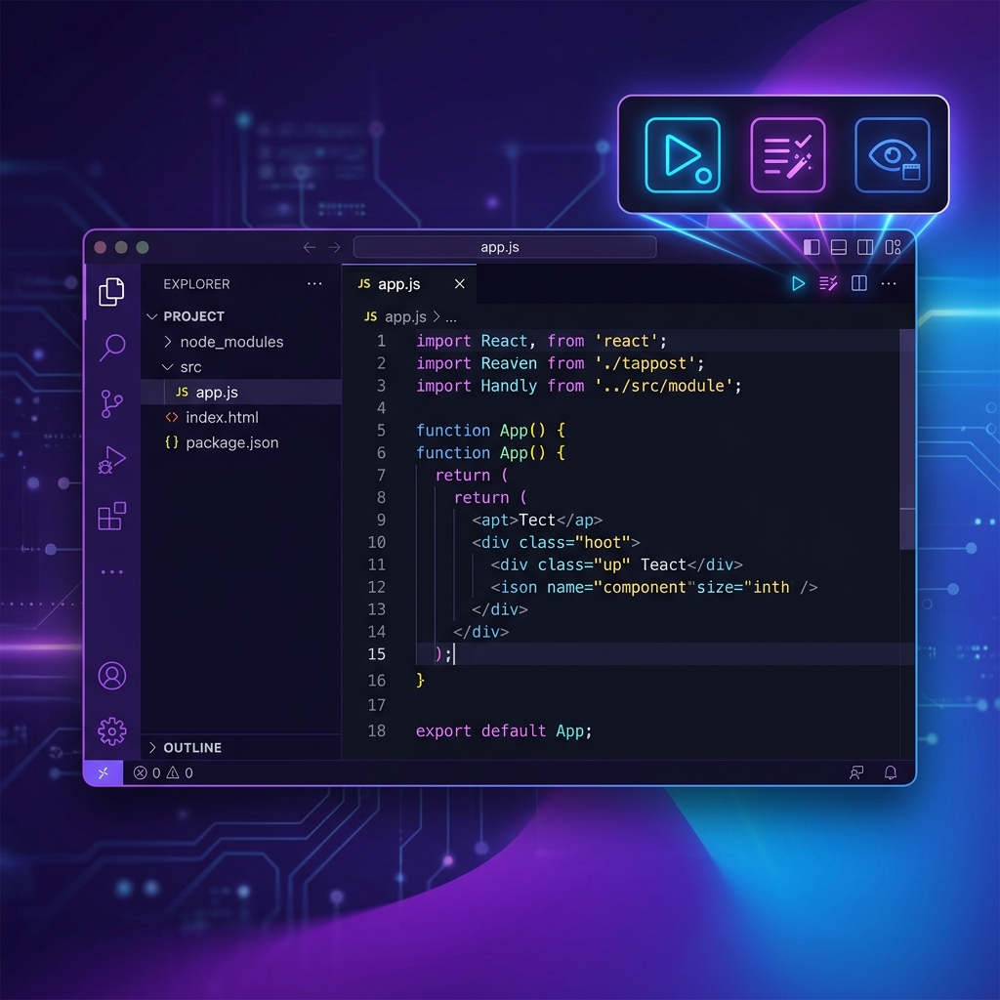

# Context Bar

  

## ⌨️ Pin Your Favorite Shortcuts.

**Context Bar** turns your editor title bar into a dashboard for your most essential keyboard shortcuts. Stop digging through menus—pin your most frequent tasks (like **Save**, **Format**, or **Terminal**) exactly where your eyes are already looking.

---

## 🛠 Features

- **Shortcut Focused**: Built-in support for common VS Code shortcuts (Ctrl+S, Ctrl+P, Ctrl+B, etc.).
- **Smart Suggestions**: The builder GUI helps you find the right Command ID by searching for the keybinding you already know.
- **Context Sensitive**: Buttons appear dynamically based on the file type (Markdown, Python, TypeScript, etc.).
- **Native Aesthetic**: A simplified configuration UI that matches your VS Code theme perfectly.

---

## 🏗 How to Configure

1. Open the **Command Palette** (`Ctrl+Shift+P`).
2. Search for **"Context Bar: Configure Shortcuts"**.
3. Add a new action and type a shortcut (like "Ctrl+S") into the command field to see suggestions.
4. Pick a Codicon and you're done!

### Dynamic Rules
You can set buttons to show only for specific files:
- **Always Visible**: Visible for all editors.
- **Language ID**: Only show for specific languages (e.g., `markdown`).

---

## 🔍 Examples

- **Markdown**: Pin `Ctrl+Shift+V` for a quick preview side-by-side.
- **Python**: Pin `Shift+Enter` to run the current file in the terminal.
- **General**: Pin `Alt+Shift+F` for a quick format button.

---

  Your Shortcuts. One Click Away.

